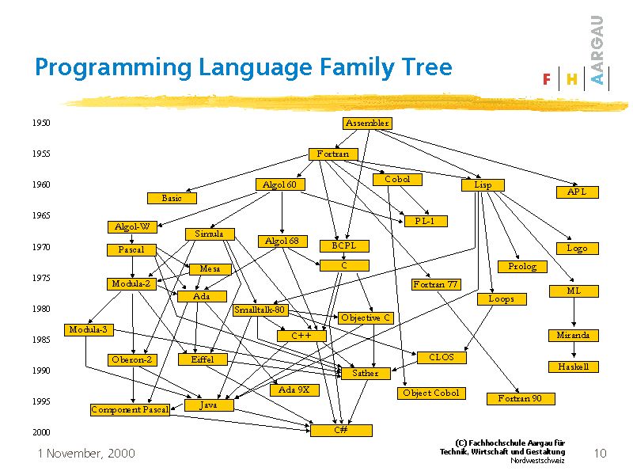

# Sprawy organizacyjne

## Sprawy organizacyjne

* Sylabus jest dostępny w systemie USOS.
* Regulamin zajęć dostępny jest na stronie prowadzącego zajęcia http://wmii.uwm.edu.pl/~piojas/.
* Forma zaliczenia: egzamin.
* Wykład - 30 godzin.
* https://github.com/pjastr/ProgramowanieStrukturalne2021


## Wymagania wstępne

* Znajomość podstawowych konstrukcji programistycznych (ze wstępu do programowania).

Ewentualne braki należy opanować w samodzielnym zakresie. 

W razie problemów zapraszam na konsultacje.

# Programowanie

## Programowanie - co to jest?

Programowanie:

* to instruowanie komputera, co ma robić.

* to co robi "programista" gdy pisze "program".

* przekazanie fragmentu rzeczywistości do komputera.

---



# Generacje języków programowania

## Pierwsza generacja 

Język maszynowy - zestaw rozkazów procesora, w którym zapis programu wyrażony jest w postaci liczb binarnych stanowiących rozkazy oraz ich argumenty.

```bash
11000101001010100101010100101010101001
11100001110101101010100011101010101101
```


## Druga generacja 

Języki asemblera (zwyczajowo asemblery) to rodzina języków programowania niskiego poziomu, których jedno polecenie odpowiada zasadniczo jednemu rozkazowi procesora. Języki te powstały na bazie języków maszynowych danego procesora poprzez zastąpienie kodów operacji ich mnemonikami. Dzięki stosowaniu kilkuliterowych skrótów poleceń zrozumiałych dla człowieka pozwala to z jednej strony na tworzenie oprogramowania, z drugiej strony bezpośrednia odpowiedniość mnemoników oraz kodu maszynowego umożliwia zachowanie wysokiego stopnia kontroli programisty nad działaniem procesora. Składnia języka asemblera zależy od architektury procesora, ale i używanego asemblera, jednak zwykle autorzy asemblerów dla danego procesora trzymają się oznaczeń danych przez producenta.

---

```bash
mov es, ax      
mov al, 24
mov ah, 0        
int 21h        
```


## Trzecia generacja 

Języki wysokiego poziomu - Pojęcie „język wysokiego poziomu” oznacza odwoływanie się do wyższego poziomu abstrakcji niż poziom kodu maszynowego, a nawet poziom języków niskopoziomowych. Zamiast zajmować się rejestrami, adresami pamięci oraz stosami, języki wysokiego poziomu dotyczą zmiennych, tablic, obiektów, zaawansowanych arytmetycznych oraz logicznych wyrażeń, podprogramów i funkcji, pętli, kroków oraz innych abstrakcyjnych konceptów komputerowych, z naciskiem na użyteczność ponad optymalną wydajność programu. 

## Czwarta generacja

* aplikacja składana z "prefabrykatów"
* programowanie obiektowe

## Piąta generacja?

* AI
* systemy samouczące, samoprogramujące?

# Paradygmaty programowania

## Paradygmat programowania

Paradygmat programowania — sposób patrzenia programisty na przepływ
sterowania i wykonywanie programu komputerowego.

---


## Programowanie imperatywne

Programowanie imperatywne to najbardziej pierwotny sposób programowania, w którym program postrzegany jest jako ciąg poleceń dla komputera.

Ściślej, obliczenia rozumiemy tu jako sekwencję poleceń zmieniających krok po kroku stan maszyny, aż do uzyskania oczekiwanego wyniku.

Stan maszyny należy z kolei rozumieć jako zawartość całej pamięci oraz rejestrów i znaczników procesora.

Ten sposób patrzenia na programy związany jest ściśle z budową sprzętu komputerowego o architekturze von Neumanna, w którym poszczególne instrukcje (w kodzie maszynowym) to właśnie polecenia zmieniające ów globalny stan.

Języki wysokiego poziomu — takie jak Fortran, Algol, Pascal, Ada lub C — posługują się pewnymi abstrakcjami, ale wciąż odpowiadają paradygmatowi programowania imperatywnego.

---

```
    program pierwszy;
    var i, n, s: integer;
    begin
    read(n);
    s := 1;
    for i := 2 to n do
     s := s * i;
    write(s)
    end.
```

## Programowanie proceduralne

Programowanie proceduralne – paradygmat programowania zalecający dzielenie kodu na procedury, czyli fragmenty wykonujące ściśle określone operacje. Procedury nie powinny korzystać ze zmiennych globalnych (w miarę możliwości), lecz pobierać i przekazywać wszystkie dane (czy też wskaźniki do nich) jako parametry wywołania.

## Programowanie strukturalne

Programowanie strukturalne - jeden z paradygmatów programowania w którym celem jest konstruowanie programu zmierzające do osiągnięcia takiej jego struktury, aby stanowiła ona odzwierciedlenie struktury rozwiązywanego problemu. Kluczowym zagadnieniem w programowaniu strukturalnym jest systematyczne użycie poziomów abstrakcji w ramach opracowywania kolejnych etapów programu. Proces tworzenia programu rozpoczyna się od jego ogólnego opisu, przechodząc następnie do szczegółów. 

---

W programowaniu strukturalnym zaleca się wykorzystanie tylko kilku najważniejszych struktur sterujących:

* Iteracja - powtarzanie instrukcji w pętli do momentu w którym zostanie spełniony warunek iteracyjny
* Wybór - realizacja poszczególnych instrukcji programu w zależności od jego stanu
* Sekwencja - wykonanie poszczególnych instrukcji w kolejności
* Podprogram
* Instrukcja (przypisania, wprowadzania/wyprowadzania danych, warunkowa, wyboru, złożona, procedury

---

Uznaje się, że program nie ma postaci strukturalnej, jeżeli występuje w nim:

* instrukcja skoku (goto) na zewnątrz pętli
* instrukcja skoku (goto) do środka instrukcji warunkowej
* instrukcja skoku (goto) do środka pętli
* instrukcja skoku (goto) do innej części programu

## Programowanie obiektowe

W programowaniu obiektowym program to zbiór porozumiewających się ze sobą obiektów, czyli jednostek zawierających pewne dane i umiejących wykonywać na nich pewne operacje.

Ważną cechą jest tu powiązanie danych (czyli stanu) z operacjami na nich (czyli poleceniami) w całość, stanowiącą odrębną jednostkę — obiekt.

Cechą nie mniej ważną jest mechanizm dziedziczenia, czyli możliwość definiowania nowych, bardziej złożonych obiektów, na bazie obiektów już istniejących.

Zwolennicy programowania obiektowego uważają, że ten paradygmat dobrze odzwierciedla sposób, w jaki ludzie myślą o świecie.

---

```java
      public class Hello {
        public static void main(String[] args) {
          System.out.println("Hello, I am James B.");
        }
      }
```

## Programowanie deklaratywne

Programowanie deklaratywne — rodzina paradygmatów programowania, które nie są z natury imperatywne. W przeciwieństwie do programów napisanych imperatywnie, programista opisuje warunki, jakie musi spełniać końcowe rozwiązanie (co chcemy osiągnąć), a nie szczegółową sekwencję kroków, które do niego prowadzą (jak to zrobić). Programowanie deklaratywne często traktuje programy jako pewne hipotezy wyrażone w logice formalnej, a wykonywanie obliczeń jako ich dowodzenie.

## Programowanie funkcyjne

Tutaj program to po prostu złożona funkcja (w sensie matematycznym), która otrzymawszy dane wejściowe wylicza pewien wynik.

* Zasadniczą różnicą w stosunku do poprzednich paradygmatów jest brak stanu maszyny: nie ma zmiennych, a co za tym idzie nie ma żadnych efektów ubocznych.
* Nie ma też imperatywnych z natury, tradycyjnie rozumianych pętli (te wymagają np. zmiennych do sterowania ich przebiegiem).
* Konstruowanie programów to składanie funkcji, zazwyczaj z istotnym wykorzystaniem rekurencji. Charakterystyczne jest również definiowanie funkcji wyższego rzędu, czyli takich, dla których argumentami i których wynikami mogą być funkcje (a nie tylko „proste” dane jak liczby lub napisy).


---

```
     (DEFINE (suma m n)
       (IF (> m n)
         0
         (+ m (suma (+ m 1) n))
       )
     )
```


## Programowanie logiczne

Na program składa się zbiór zależności (przesłanki) i pewne stwierdzenie (cel).

* Wykonanie programu to próba udowodnienia celu w oparciu o podane przesłanki.
* Obliczenia wykonywane są niejako „przy okazji” dowodzenia celu.
* Podobnie jak w programowaniu funkcyjnym, nie „wydajemy rozkazów”, a jedynie opisujemy, co wiemy i co chcemy uzyskać.

---

```
     ojciec(jan, jerzy).
     ojciec(jerzy, janusz).
     ojciec(jerzy, józef).
     dziadek(X, Z) :- ojciec(X, Y), ojciec(Y, Z).
     ?- dziadek(X, janusz).
```

# Język C

## Czemu język C?

https://www.tiobe.com/tiobe-index/


## Historia języka C

Poprzednikiem języka C był interpretowany język B, który Dennis Ritchie rozwinął w język C. Pierwszy okres rozwoju języka to lata 1969–1973. W roku 1973 w języku C udało się zaimplementować jądro systemu operacyjnego Unix. W 1978 roku Brian Kernighan i Dennis Ritchie opublikowali dokumentację języka pt. C Programming Language (wydanie polskie: Język C).

## Standardy

|    Year   |    C Standard    |
|:---------:|:----------------:|
| 1972      | Birth            |
| 1978      | K&R C            |
| 1989/1990 | ANSI C and ISO C |
| 1999      | C99              |
| 2011      | C11              |
| 2017      | C17              |
| TBD       | C2x              |

https://en.wikipedia.org/wiki/C_(programming_language)#History

## Sposób działania C

1. Kod źródłowy
2. Kompilacja
3. Kod wynikowy

## Hello World

```c
#include <stdio.h>
#include <stdlib.h>

int main()
{
    printf("Hello world!\n");
    return 0;
}
```

## Wbudowane typy danych

https://en.wikipedia.org/wiki/C_data_types

https://devdocs.io/c/language/arithmetic_types

## Deklaracja zmiennej

```c
typ nazwa_zmiennej;
```

Przykład:

```c
int a;
```

Przykład z nadaniem wartości:

```c
int a=7;
```

## Zasięg zmiennej

* globalne - zadeklarowane poza `main`, dostępne dla wszystkich funkcji.

* lokalne - zadeklarowane w innym miejscu

---

```c
#include <stdio.h>

int a,b; 

void func1 ()
{
    a=3;
}
 
int main ()
{
    b=3;
    a=2;
    return 0;
}
```

---

```c
int a=1; /* zmienna globalna */

int main()
{
    int a=2;         /* to już zmienna lokalna */
    printf("%d", a); /* wypisze 2 */
}
```

## Czas życia

Czas życia to czas od momentu przydzielenia dla zmiennej miejsca w pamięci (stworzenie obiektu) do momentu zwolnienia miejsca w pamięci (likwidacja obiektu).

```c
int main()
{
 int a = 10;
 {         /* otwarcie lokalnego bloku */
     int b = 10;
     printf("%d %d", a, b);
 }         /* zamknięcie lokalnego bloku */

    printf("%d %d", a, b);  /* BŁĄD: b juz nie istnieje */
}
```

## Stałe

Stała, różni się od zmiennej tylko tym, że nie można jej przypisać innej wartości w trakcie działania programu. Wartość stałej ustala się w kodzie programu i nigdy ona nie ulega zmianie.

```c
const typ nazwa_stałej=wartość;
```
## `#define`

`#define` - dyrektywa preprocessora.

Linia pozwalająca zdefiniować stałą, funkcję, słowo kluczowe lub makro, które będzie potem podmienione w kodzie programu na odpowiednią wartość lub może zostać użyte w instrukcjach warunkowych dla preprocesora.

```c
#define NAZWA_STALEJ WARTOSC
```

```c
#define NAZWA_STALEJ
```

---

```c
#include <stdio.h>

#define SIX 1+5
#define NINE 8+1

int main(void)
{
    printf("%d * %d = %d\n", SIX, NINE, SIX * NINE);
    return 0;

}
```

## Operator przypisania

Operator przypisania ("="), jak sama nazwa wskazuje, przypisuje wartość prawego argumentu lewemu.

```c
int a = 3, b;
b = a;
printf("%d\n", b); /* wypisze 3 */
```

---

C umożliwia też skrócony zapis postaci a #= b;, gdzie # jest jednym z operatorów: +, -, *, /, %, &, |, ^, << lub >>. Ogólnie rzecz ujmując zapis a #= b; jest równoważny zapisowi a = a # (b).

```c
int a = 1;
a += 5;     /* to samo, co a = a + 5;       */
a /= a + 2; /* to samo, co a = a / (a + 2); */
a %= 2;     /* to samo, co a = a % 2;       */
```

## Operatory arytmetyczne dwuargumentowe

* dodawanie ("+"),
* odejmowanie ("-"),
* mnożenie ("*"),
* dzielenie ("/"),
* reszta z dzielenia ("%") określona tylko dla liczb całkowitych (tzw. dzielenie modulo).

## Jednoargumentowe operatory arytmetyczne

* pre-inkrementacja ("++i"),
* post-inkrementacja ("i++"),
* pre-dekrementacja ("--i"),
* post-dekrementacja ("i--").

```c
int a, b, c;
a = 3;
b = a--; /* po operacji b=3 a=2 */
c = --b; /* po operacji b=2 c=2 */
```
## Operator rozmiaru `sizeof()`

Zwraca rozmiar obiektu podany w wybranej jednostce miary, np. bajtach lub słowach maszynowych.

```c
printf ("%d",sizeof(int));
```

```bash
4
```

## Operatory bitowe

* negacja bitowa (NOT)("~"),
* koniunkcja bitowa (AND)("&"),
* alternatywa bitowa (OR)("|") i
* alternatywa rozłączna (XOR) ("^")

Są zdefiniowane dla liczb całkowitych, działają na bitach i mogą być szybsze niż zwykłe operacje.

https://pl.wikibooks.org/wiki/C/Operatory#Operatory_bitowe

## Operatory porównania

* równe ("=="),
* różne ("!="),
* mniejsze ("<"),
* większe (">"),
* mniejsze lub równe ("<=")
* większe lub równe (">=")

## Operatory logiczne

* negacja (zaprzeczenie): "!"
* koniunkcja ("i"): "&&"
* alternatywa ("lub"): "||"

## Operator wyrażenia warunkowego

```c
a ? b : c
```

Najpierw oceniana jest wartość logiczna wyrażenia `a`; jeśli jest ono prawdziwe, to zwracana jest wartość `b`, jeśli natomiast wyrażenie `a` jest nieprawdziwe, zwracana jest wartość `c`.

## Kolejność operatorów


## Debugowanie

Sesja - live coding.

# Instrukcje sterujące

## Instrukcje warunkowe

```c
 if (wyrażenie) {
   /* blok wykonany, jeśli wyrażenie jest prawdziwe */
 }
```
 
```c
  if (wyrażenie) {
   /* blok wykonany, jeśli wyrażenie jest prawdziwe */
 } else {
   /* blok wykonany, jeśli wyrażenie jest nieprawdziwe */
 }
```
 
---

```
switch (wyrażenie) {
case wartość1: 
 break;
case wartość2: 
 break;
/* ... */
default: 
 break;
}
```

# Pętle

## `for`

```
for (wyrażenie1; wyrażenie2; wyrażenie3) {
   /* instrukcje do wykonania w pętli */
 }
```

## `do ...while`

```c
 do {
   /* instrukcje do wykonania w pętli */
 } while (warunek);
```

## `while`

```c
while (warunek) {
   /* instrukcje do wykonania w pętli */
 }
```

# Funkcja

## Funkcje w C

Ogólna składnia funkcji

```c
typ identyfikator (typ1 argument1, typ2 argument2)
{
  /* instrukcje */
}
```

procedura

```
void identyfikator (typ1 argument1, typ2 argument2)
{
  /* instrukcje */
}
```

## Rekurencja

Rekurencja, zwana także rekursją (ang. recursion, z łac. recurrere, przybiec z powrotem) – odwoływanie się np. funkcji lub definicji do samej siebie.

$$F_n := \begin{cases}
0 & \text{dla } n = 0, \\
1 & \text{dla } n = 1, \\
F_{n-1}+F_{n-2} & \text{dla } n > 1.
\end{cases}$$

## Bibliografia

* http://www.aistudy.com/program/images/programming_language_family_tree.gif, dostęp online 20.02.2020.
* Wojciech Sobieski, Języki Programowania, http://pracownicy.uwm.edu.pl/wojsob/pliki/publikacje/jp-01.pdf, dostęp online 20.02.2020.
* https://pl.wikipedia.org/wiki/Asembler, dostęp online 20.02.2020.
* https://pl.wikipedia.org/wiki/J%C4%99zyk_wysokiego_poziomu, dostęp pnline 20.02.2020.
* http://wazniak.mimuw.edu.pl/index.php?title=Paradygmaty_programowania/Wyk%C5%82ad_1:_Co_to_jest_paradygmat_programowania%3F, dostęp online: 20.02.2020.
* https://mfiles.pl/pl/index.php/Programowanie_strukturalne, dostęp online 20.02.2020.


---


* https://pl.wikipedia.org/wiki/C_(j%C4%99zyk_programowania), dostęp online 20.02.2020.
* https://pl.wikibooks.org/wiki/C/Zmienne#Deklaracja_zmiennych, dostęp online 20.02.2020.
* https://pl.wikibooks.org/wiki/C/Operatory, dostęp online 20.02.2020.
* https://pl.wikibooks.org/wiki/C/Funkcje, dostęp online 10.03.2020.
* https://pl.wikipedia.org/wiki/Rekurencja, dostęp online 10.03.2020.
* https://pl.wikibooks.org/wiki/C/Instrukcje_steruj%C4%85ce, dostęp online 10.03.2020.